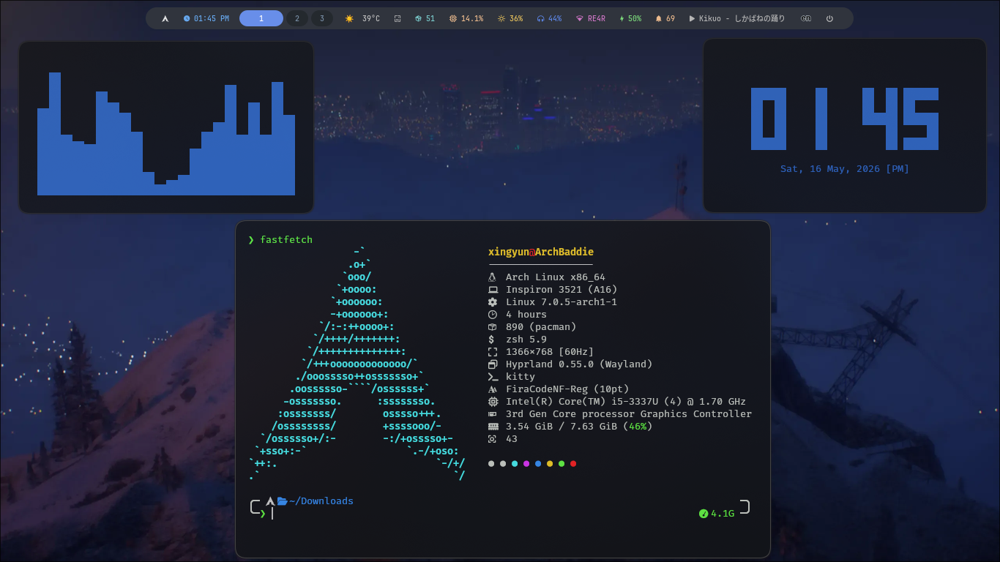
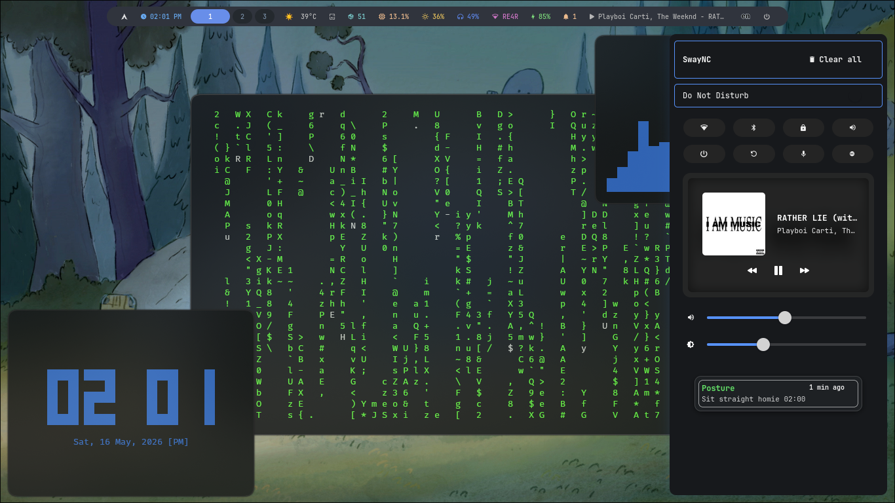
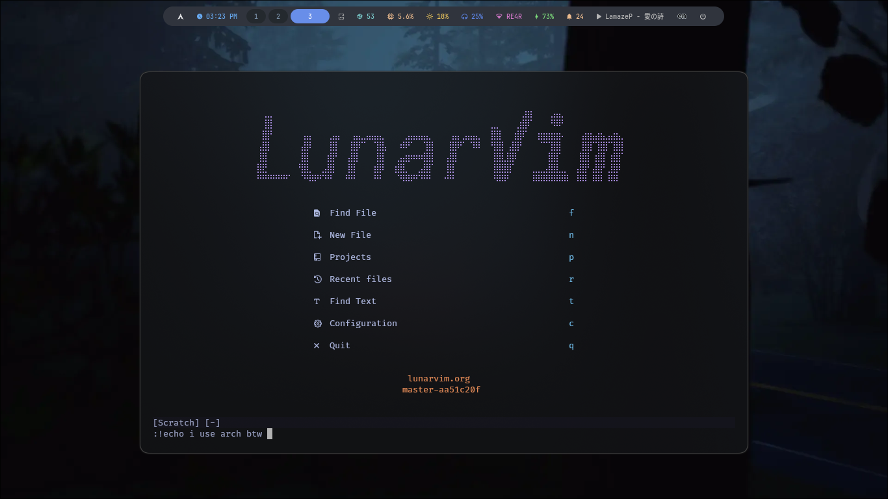

# Arch Hyprland dotfiles

### Screenshots





## Install

```bash
git clone --depth=1 https://github.com/LUCKYS1NGHH/dotfiles.git
cd dotfiles
cp -r ~/.config/* ~/.config/ 
```

# Tools & Dependencies
#### you can replace any of these tools with your preferred alternatives after cloning.

| Name      | Dependencies |
|-----------|--------------|
| cava      |  N/A         |
| clock-rs  |  N/A         |
| waybar    |  `swaync`, `pacman-contrib`, `NetworkManager`, `network-manager-applet`, `brightnessctl`, `pavucontrol` |
| kitty     |  `ttf-firacode-nerd` |
| fastfetch |  N/A         |
| hypr      |  `hyprlock`, `hyprshot`, `swaync`, `waybar`, `hyprsunset`, `kitty`, `thunar`, `wl-clipboard`            |
| swaync    | `hyprlock`, `network-manager-applet`, `blueman`, `obs-studio`, `pavucontrol` |
