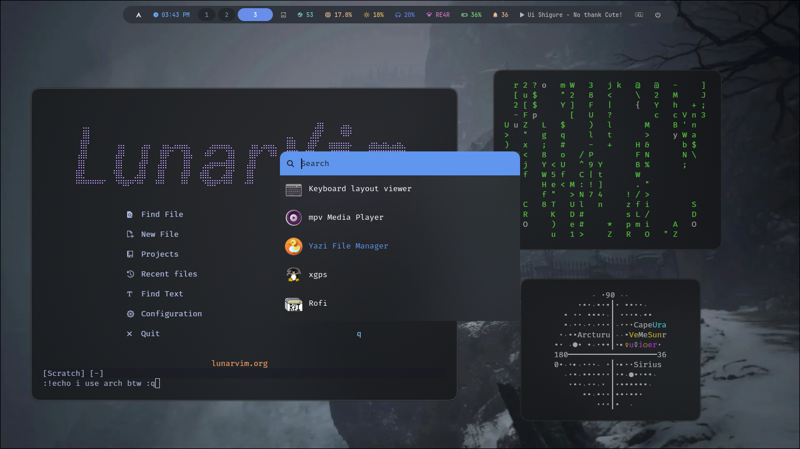
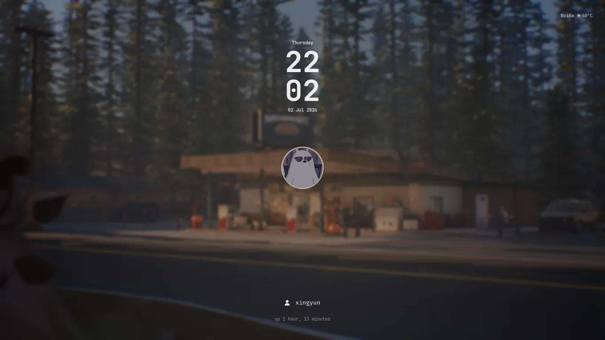
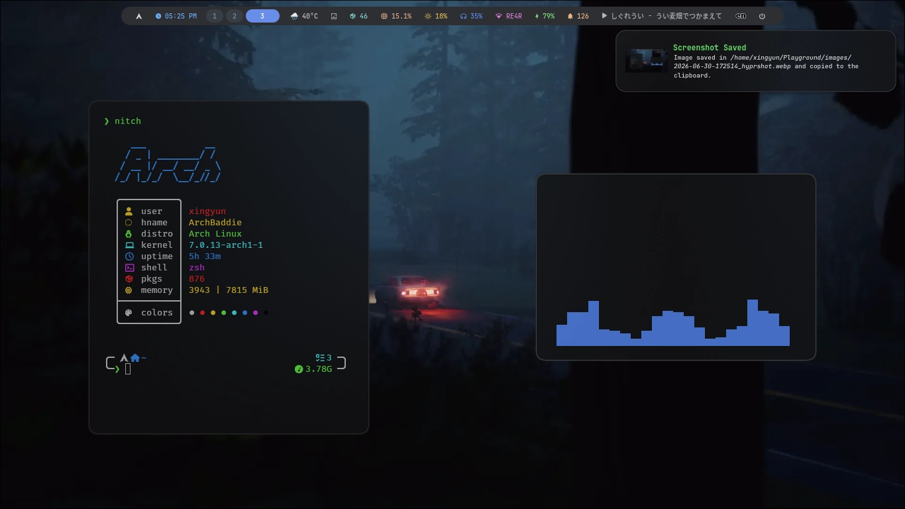

# Arch Hyprland Dotfiles ⚡

A personal Hyprland setup on Arch Linux — tiling Wayland compositor with a curated set of tools for a clean, keyboard-driven workflow.

---

## Performance

Runs smooth in NO-GPU Desktops/Laptops

##### CPU usage (idle): 2-4%
##### Ram Usage (idle): 300-400 MB
> Hyprland, SwayNC and Waybar usage combined

---

## Showcase 🎨

<p>
  
  
  
  
  
  
</p>

## Install 📦

> [!IMPORTANT]
> Before installing, please backup your `~/.config` directory.
> Also your Hyprland version should be 0.55v+, so it can use the lua config.

```bash
git clone --depth=1 https://github.com/LUCKYS1NGHH/dotfiles.git
cd dotfiles
cp -r .config/* ~/.config/
```

> ##### If you want more waybar style options, checkout my [`waybar-configs`](https://github.com/LUCKYS1NGHH/waybar-configs.git) collection

---

## Tools & Dependencies 🛠️

#### You can replace any of these tools with your preferred alternatives after cloning.

| Tool      | Description                                | Dependencies |
|-----------|--------------------------------------------|--------------|
| cava      | Terminal Audio Visualizer                  | `pipewire`   |
| clock-rs  | CLI clock                                  | N/A          |
| waybar    | Status bar                                 | `swaync`, `playerctl`, `pacman-contrib`, `NetworkManager`, `network-manager-applet`, `brightnessctl`, `pavucontrol`, `python3`, `python-requests`, `ttf-jetbrains-mono-nerd`, `ttf-firacode-nerd`, `noto-fonts-cjk` |
| kitty     | Fast GPU-accelerated terminal              | `ttf-firacode-nerd` |
| fastfetch | System info                                | A nerd font, recommend: `ttf-firacode-nerd` |
| hypr*     | hyprland window-manager and its utilities  |  `hyprlock`, `hyprshot`, `swaync`, `waybar`, `hyprsunset`, `kitty`, `thunar`, `wl-clipboard`, `rofi`, `cliphist` |
| swaync    | Notification center                        |`hyprlock`, `network-manager-applet`, `blueman`, `obs-studio`, `pavucontrol`, `playerctl` |
| rofi      | Dynamic Menu                               | `cliphist`, `rofi-emoji`, `noto-fonts-emoji` |

## Key-bindings ⌨️

### Applications 🚀
| Action | Keybinding |
|--------|------------|
| Terminal (`$terminal`) | `Super` + `Q` |
| File Manager (`$fileManager`) | `Super` + `E` |
| Brave Browser | `Super` + `B` |
| wlogout | `Super` + `Shift` + `E` |
| hyprshutdown / Hyprland exit | `Super` + `M` |

### Screenshots (hyprshot) 🖼️ 
| Action | Keybinding |
|--------|------------|
| Full output | `Super` + `Shift` + `F` |
| Window | `Super` + `Shift` + `W` |
| Region | `Super` + `Shift` + `R` |

### Rofi 🔍
| Action | Keybinding |
|--------|------------|
| App Launcher | `Super` + `D` |
| Clipboard History (cliphist) | `Super` + `Shift` + `V` |
| Emoji Picker | `Super` + `G` |
| Wallpaper Changer (Pick) | `Super` + `W` |
| `$menu` | `Super` + `R` |

### Window Management 🪟
| Action | Keybinding |
|--------|------------|
| Kill active window | `Super` + `C` |
| Toggle floating | `Super` + `V` |
| Pseudo (dwindle) | `Super` + `P` |
| Toggle split (dwindle) | `Super` + `J` |
| SwayNC notification panel | `Super` + `N` |

### Focus 🎯
| Action | Keybinding |
|--------|------------|
| Focus left | `Super` + `←` |
| Focus right | `Super` + `→` |
| Focus up | `Super` + `↑` |
| Focus down | `Super` + `↓` |

### Resize ↔️
| Action | Keybinding |
|--------|------------|
| Expand right | `Super` + `Shift` + `→` |
| Shrink left | `Super` + `Shift` + `←` |
| Shrink up | `Super` + `Shift` + `↑` |
| Expand down | `Super` + `Shift` + `↓` |

### Swap 🔄
| Action | keybinding |
|--------|------------|
| Swap with left window | `Super` + `Shift` + `h` |
| Swap with right window | `Super` + `Shift` + `j` |
| Swap with top window | `Super` + `Shift` + `k` |
| Swap with bottom window | `Super` + `Shift` + `l` |

### Workspaces 🗂️
| Action | Keybinding |
|--------|------------|
| Switch to workspace 1–10 | `Super` + `1`–`0` |
| Move window to workspace 1–10 | `Super` + `Shift` + `1`–`0` |
| Toggle special workspace (magic) | `Super` + `S` |
| Move window to special workspace | `Super` + `Shift` + `S` |
| Next workspace (scroll) | `Super` + `Scroll Down` |
| Previous workspace (scroll) | `Super` + `Scroll Up` |

[!NOTE]
It's possible that the dotfiles not working properly on your system.

## Author

LUCKYS1NGHH / https://github.com/LUCKYS1NGHH/dotfiles
