# Arch + Hyprland Dotfiles ⚡

A personal Hyprland setup on Arch Linux — tiling Wayland compositor with a curated set of tools for a clean, keyboard-driven workflow.

#### Hyprland v0.55+ Lua Config Available

---

## Performance

Runs smooth in No Dedicated-GPU Desktops or Laptops

- CPU usage (idle): 2-4%
- Ram Usage (idle): 300-400 MB

> Hyprland, SwayNC and Waybar usage combined

---

## Showcase 🎨

<p>
  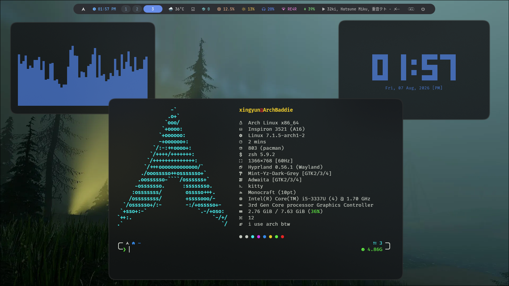
  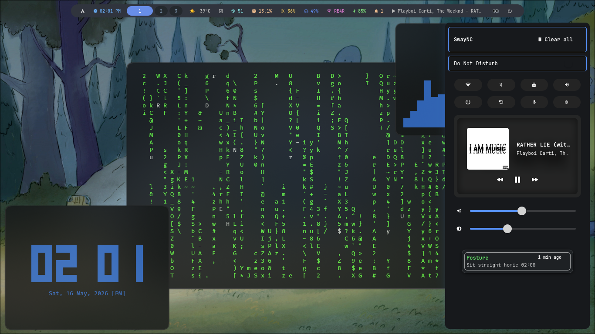
  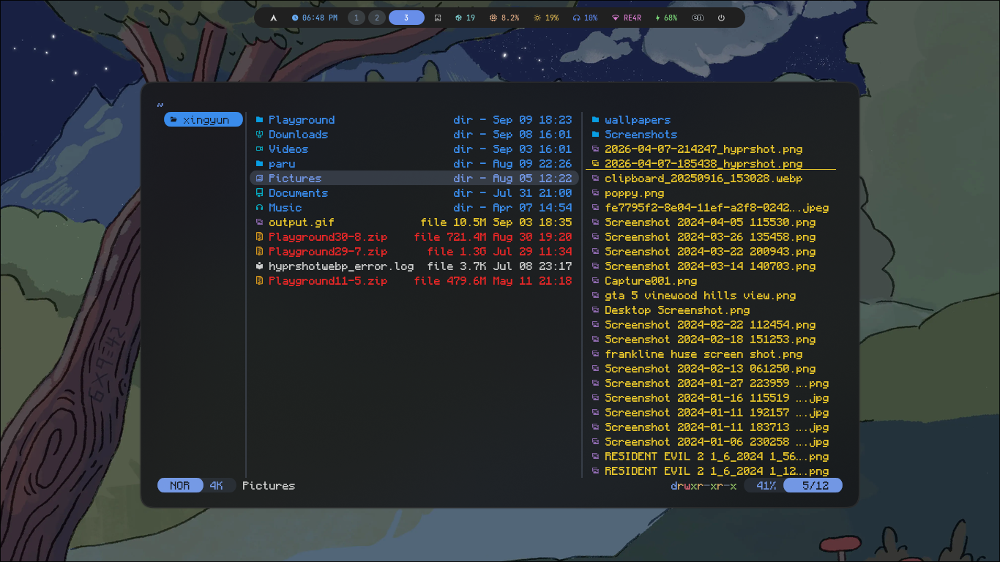
  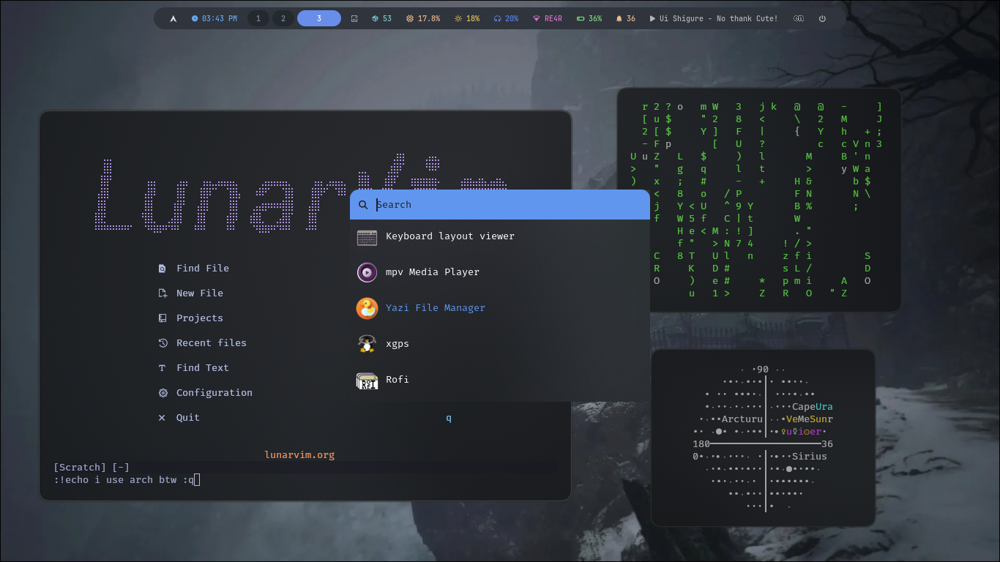
  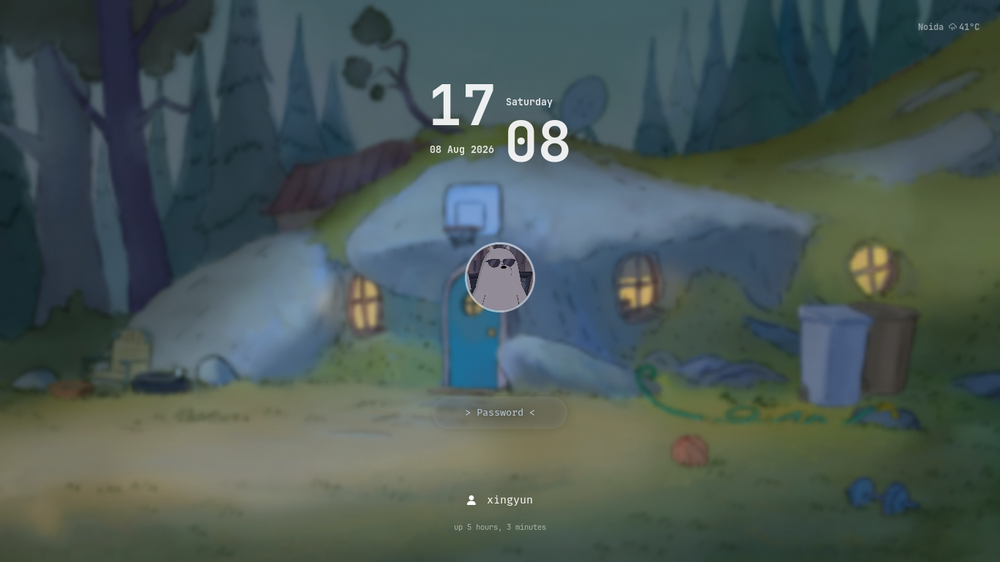
  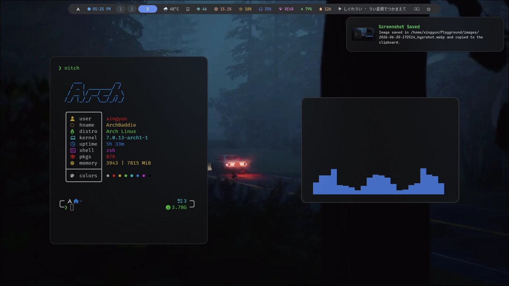
</p>

<details>
<summary>Checkout wallpapers</summary>
  
  
  
  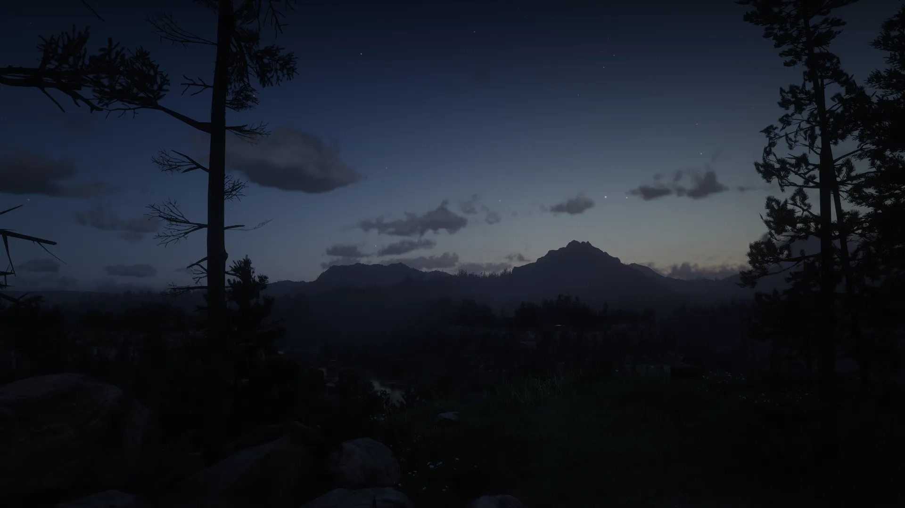
  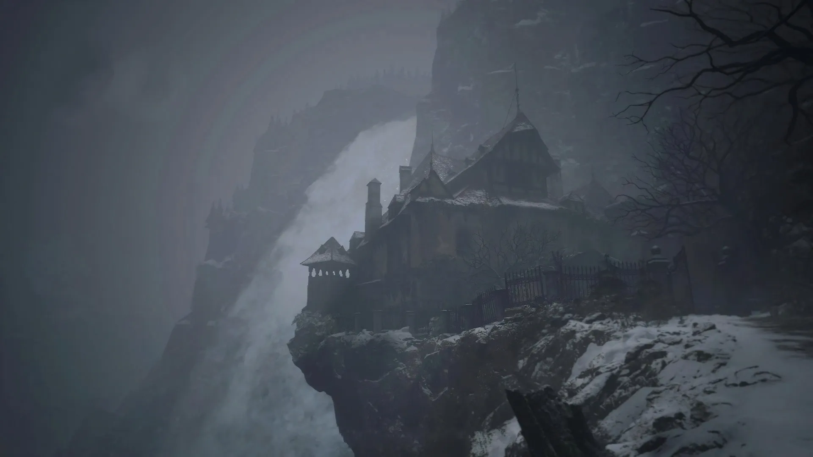
  
  
  
  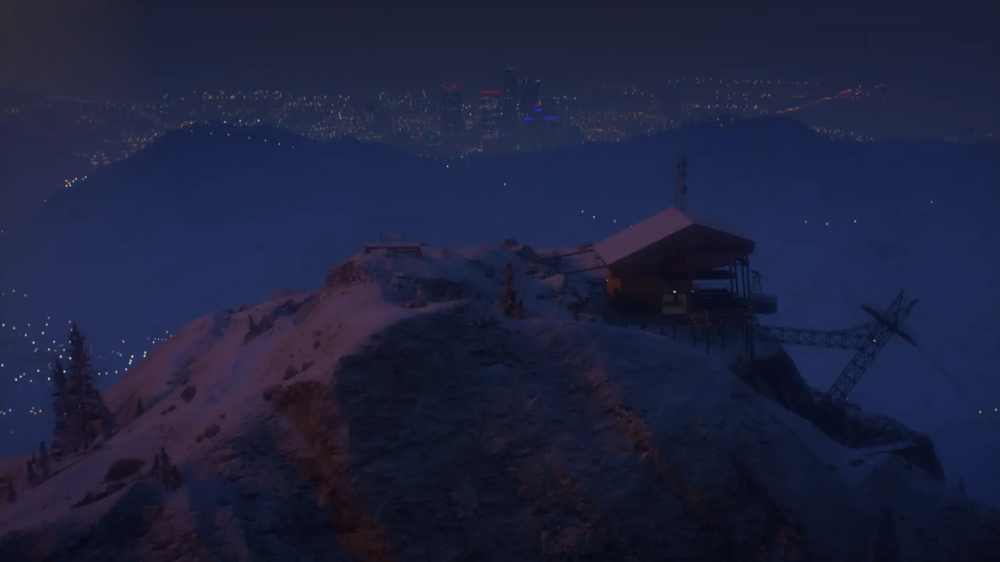
  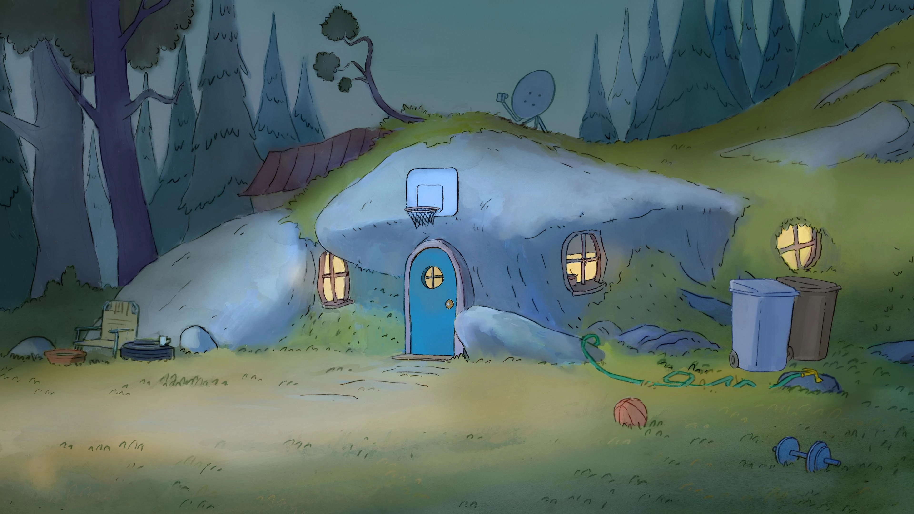
  
  
  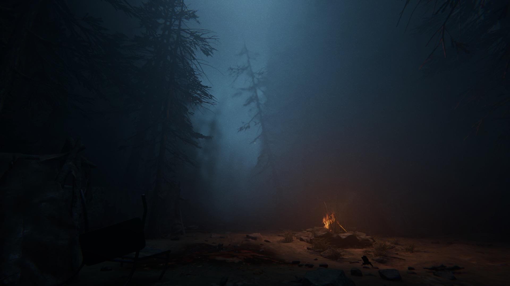
  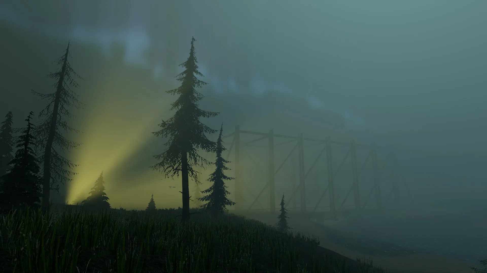
</details>

---

## Tools & Dependencies 🛠️

#### You can replace any of these tools with your preferred alternatives after cloning.

| Tool      | Description                                | Dependencies |
|-----------|--------------------------------------------|--------------|
| cava      | Terminal Audio Visualizer                  | `pipewire`   |
| clock-rs  | CLI clock                                  | N/A          |
| waybar    | Status bar                                 | `swaync`, `playerctl`, `pacman-contrib`, `networkmanager`, `network-manager-applet`, `brightnessctl`, `pavucontrol`, `python3`, `python-requests`, `ttf-jetbrains-mono-nerd`, `ttf-firacode-nerd`, `noto-fonts-cjk` |
| kitty     | Fast GPU-accelerated terminal              | `ttf-firacode-nerd` |
| fastfetch | System info                                | A nerd font, recommend: `ttf-firacode-nerd` |
| hypr*     | hyprland window-manager and its utilities  | `hyprlock`, `hyprshot`, `swaync`, `waybar`, `hyprsunset`, `kitty`, `thunar`, `wl-clipboard`, `rofi`, `cliphist` |
| swaync    | Notification center                        | `hyprlock`, `network-manager-applet`, `blueman`, `obs-studio`, `pavucontrol`, `playerctl` |
| rofi      | Dynamic Menu                               | `cliphist`, `rofi-emoji`, `noto-fonts-emoji` |
| yazi      | TUI File manager                           | `mupdf`, `glow`, `swayimg` |

> Install dependencies with one command

```bash
sudo pacman -S pipewire swaync playerctl waybar rofi cliphist wl-clipboard \
     pacman-contrib networkmanager brightnessctl \
     pavucontrol python3 python-requests \
     ttf-jetbrains-mono-nerd ttf-firacode-nerd noto-fonts-cjk \
     hyprlock hyprshot hyprsunset rofi-emoji yazi
```

> Optional

```bash
sudo pacman -S blueman thunar network-manager-applet mupdf glow swayimg

# blueman -> swaync
# thunar -> hyprland
# nm-applet -> waybar
# mupdf, glow, swayimg -> yazi
```

## Install 📦

> [!IMPORTANT]
> Before installing, please backup your `~/.config` directory.
> Also your Hyprland version should be v0.55+, so it can use the NEW Lua config.

```bash
git clone --depth=1 https://github.com/LUCKYS1NGHH/dotfiles.git
cd dotfiles
cp -r .config/* ~/.config/
```

> ##### If you want more Waybar style options, checkout my [`waybar-configs`](https://github.com/LUCKYS1NGHH/waybar-configs.git) collection

> [!NOTE]
> For my ZSH (shell) theme, you have to install [`ZSH`](https://github.com/zsh-users/zsh) and  [`Powerlevel10k`](https://github.com/romkatv/powerlevel10k) to use it, and then paste `.p10k.zsh` file to `~`. path should look like `~/.p10k.zsh`.

## Key-bindings ⌨️

### Applications 🚀
| Action | Keybinding |
|--------|------------|
| Terminal (`$terminal`) | <kbd>Super</kbd> + <kbd>Q</kbd> |
| File Manager (`$fileManager`) | <kbd>Super</kbd> + <kbd>E</kbd> |
| Brave Browser | <kbd>Super</kbd> + <kbd>B</kbd> |
| wlogout | <kbd>Super</kbd> + <kbd>Shift</kbd> + <kbd>E</kbd> |
| hyprshutdown / Hyprland exit | <kbd>Super</kbd> + <kbd>M</kbd> |

### Screenshots (hyprshot) 🖼️ 
| Action | Keybinding |
|--------|------------|
| Full output | <kbd>Super</kbd> + <kbd>Shift</kbd> + <kbd>F</kbd> |
| Window | <kbd>Super</kbd> + <kbd>Shift</kbd> + <kbd>W</kbd> |
| Region | <kbd>Super</kbd> + <kbd>Shift</kbd> + <kbd>R</kbd> |

### Rofi 🔍
| Action | Keybinding |
|--------|------------|
| App Launcher | <kbd>Super</kbd> + <kbd>D</kbd> |
| Clipboard History (cliphist) | <kbd>Super</kbd> + <kbd>Shift</kbd> + <kbd>V</kbd> |
| Emoji Picker | <kbd>Super</kbd> + <kbd>G</kbd> |
| Wallpaper Changer (Pick) | <kbd>Super</kbd> + <kbd>W</kbd> |
| `$menu` | <kbd>Super</kbd> + <kbd>R</kbd> |

### Window Management 🪟
| Action | Keybinding |
|--------|------------|
| Kill active window | <kbd>Super</kbd> + <kbd>C</kbd> |
| Toggle floating | <kbd>Super</kbd> + <kbd>V</kbd> |
| Pseudo (dwindle) | <kbd>Super</kbd> + <kbd>P</kbd> |
| Toggle split (dwindle) | <kbd>Super</kbd> + <kbd>J</kbd> |
| SwayNC notification panel | <kbd>Super</kbd> + <kbd>N</kbd> |

### Focus 🎯
| Action | Keybinding |
|--------|------------|
| Focus left | <kbd>Super</kbd> + <kbd>←</kbd> |
| Focus right | <kbd>Super</kbd> + <kbd>→</kbd> |
| Focus up | <kbd>Super</kbd> + <kbd>↑</kbd> |
| Focus down | <kbd>Super</kbd> + <kbd>↓</kbd> |

### Resize ↔️
| Action | Keybinding |
|--------|------------|
| Expand right | <kbd>Super</kbd> + <kbd>Shift</kbd> + <kbd>→</kbd> |
| Shrink left | <kbd>Super</kbd> + <kbd>Shift</kbd> + <kbd>←</kbd> |
| Shrink up | <kbd>Super</kbd> + <kbd>Shift</kbd> + <kbd>↑</kbd> |
| Expand down | <kbd>Super</kbd> + <kbd>Shift</kbd> + <kbd>↓</kbd> |

### Swap 🔄
| Action | keybinding |
|--------|------------|
| Swap with left window | <kbd>Super</kbd> + <kbd>Shift</kbd> + <kbd>h</kbd> |
| Swap with right window | <kbd>Super</kbd> + <kbd>Shift</kbd> + <kbd>j</kbd> |
| Swap with top window | <kbd>Super</kbd> + <kbd>Shift</kbd> + <kbd>k</kbd> |
| Swap with bottom window | <kbd>Super</kbd> + <kbd>Shift</kbd> + <kbd>l</kbd> |

### Workspaces 🗂️
| Action | Keybinding |
|--------|------------|
| Switch to workspace 1–10 | <kbd>Super</kbd> + <kbd>1</kbd>–<kbd>0</kbd> |
| Move window to workspace 1–10 | <kbd>Super</kbd> + <kbd>Shift</kbd> + <kbd>1</kbd>–<kbd>0</kbd> |
| Toggle special workspace (magic) | <kbd>Super</kbd> + <kbd>S</kbd> |
| Move window to special workspace | <kbd>Super</kbd> + <kbd>Shift</kbd> + <kbd>S</kbd> |
| Next workspace (scroll) | <kbd>Super</kbd> + <kbd>Scroll Down</kbd> |
| Previous workspace (scroll) | <kbd>Super</kbd> + <kbd>Scroll Up</kbd> |

### Magnifier 🔍
| Action | Keybinding |
|--------|------------|
| Zoom-In | <kbd>Super</kbd> + <kbd>Z</kbd> |
| Zoom-In Increase | <kbd>Super</kbd> + <kbd>KP_ADD</kbd> |
| Zoom-Out | <kbd>Super</kbd> + <kbd>minus</kbd> |

### File manager (yazi) 🗃️
| Action | Keybinding |
|--------|------------|
| Copy-paste path | <kbd>y</kbd> + <kbd>p</kbd> |
| Copy-paste dir | <kbd>y</kbd> + <kbd>d</kbd> |
| Copy-paste file | <kbd>y</kbd> + <kbd>f</kbd> |
| Jump to Downloads | <kbd>1</kbd> |
| Jump to Documents | <kbd>2</kbd> |
| Jump to Pictures | <kbd>3</kbd> |

---

> [!NOTE]
> It's possible that the dotfiles not working properly on your system, so if facing any problem, please open an issue.

## Ricer

LUCKYS1NGHH / https://github.com/LUCKYS1NGHH/dotfiles
